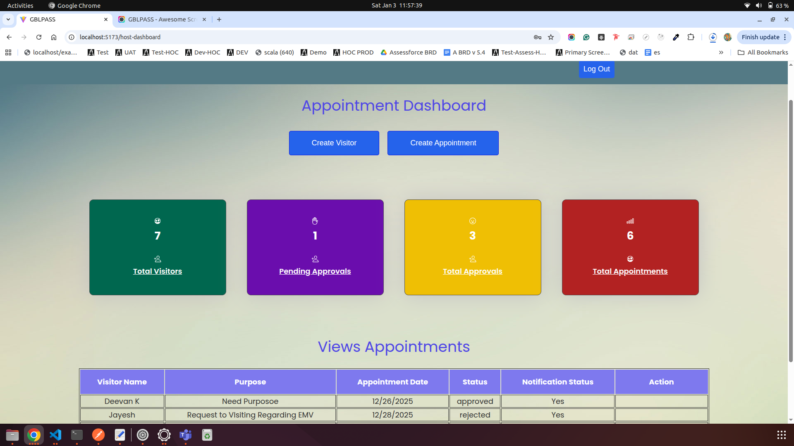
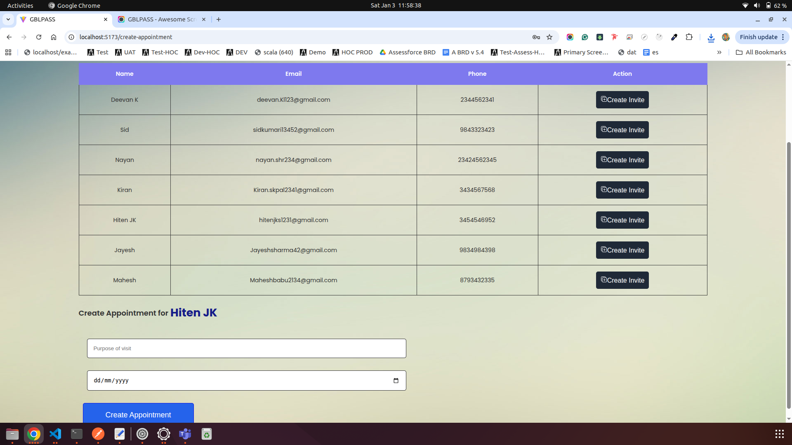
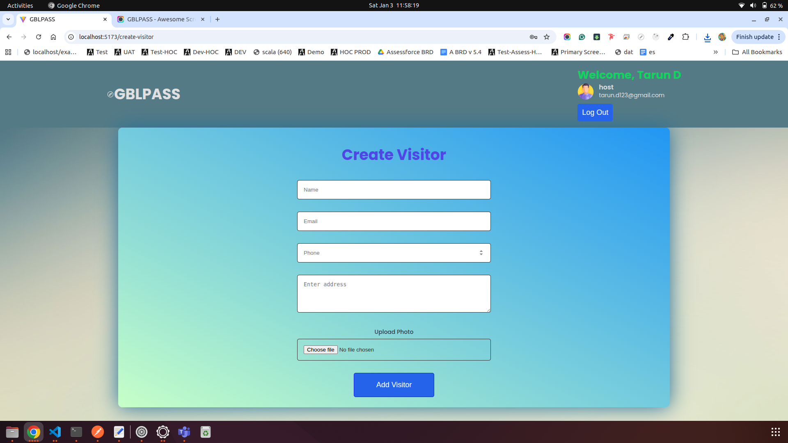
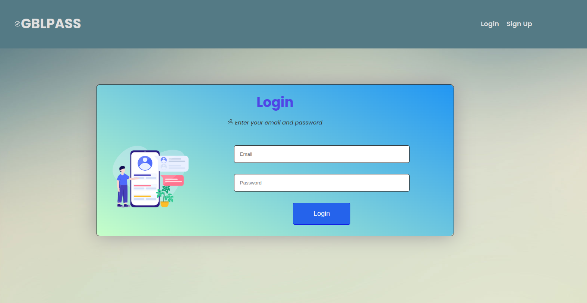
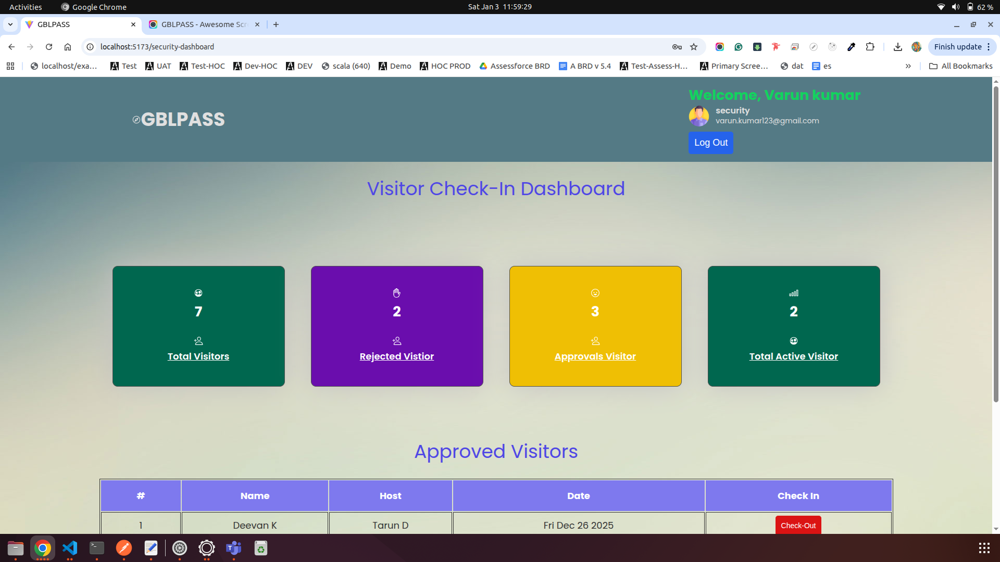
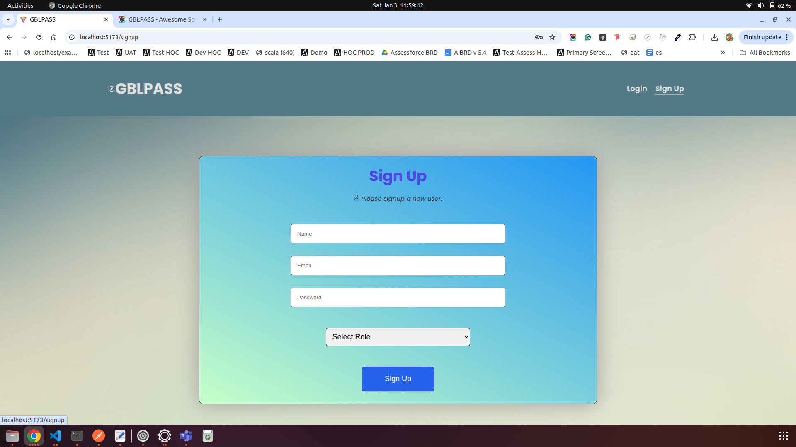

# React + Vite

# This Visitor Management Website build with Vite React

## comment To Run
 npm i axios
 npm i react-router-dom
 npm i jsqr
 npm i html5-qrcode
 npm i qrcode

Admin Role
ladganesh22@gmail.com
ganesH123$

Security Role
varun.kumar123@gmail.com
varuN123$

Host Role
tarun.d123@gmail.com
taruN123$

# Netlify Deployment Link
https://visitor-management-fronend-1.netlify.app/login

# Visitor Management Back end GitHub Link
https://github.com/ladganesh22-cloud/visitor-management-backend-1

<video controls src="GBLPASS.mp4" title="Title"></video>

